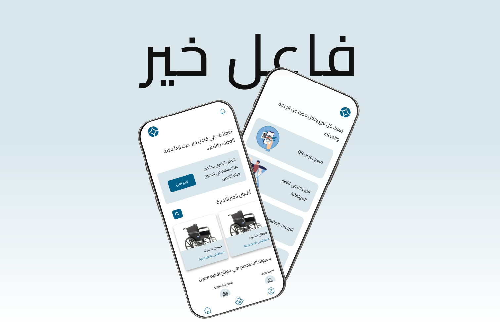

# Faeil Khayr Dashboard Application


# Description

Hello and welcome to Faeil Khayr Repo, where you will be introduced to the hospital donation and inventory management application that modernizes the approach to medical device management in health institutions. This software provides hospital staff with the ability to create hospital accounts, monitor and manage donations, make informed decisions to accept or reject donations, and generate QR codes to verify accepted donations. This application is part of the Philanthropist project

## 🚀 Check out the app!

### Prerequisites

Before you begin, ensure you have met the following requirements:

**Node.js:** Make sure you have Node.js installed on your machine. You can download it from [nodejs.org](https://nodejs.org/).

**Expo CLI:** If you haven't already, install the Expo CLI globally:

  ```bash
  npm install -g expo-cli
```

### Installing the app on your machine

```bash
git clone https://github.com/ja03/CR-HospitalApp
```

```bash
cd hospital-app-2.0
```

```bash
npm install
```

### Start the app

```bash
expo start
```

